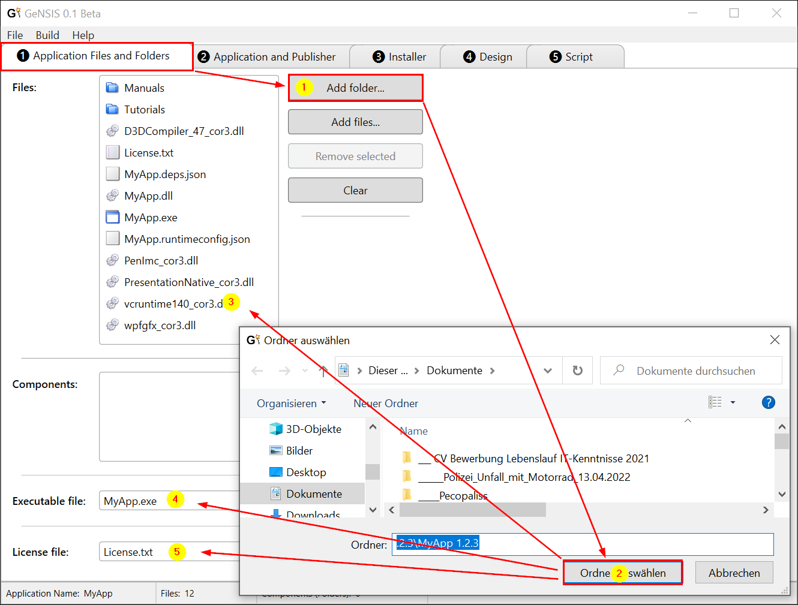
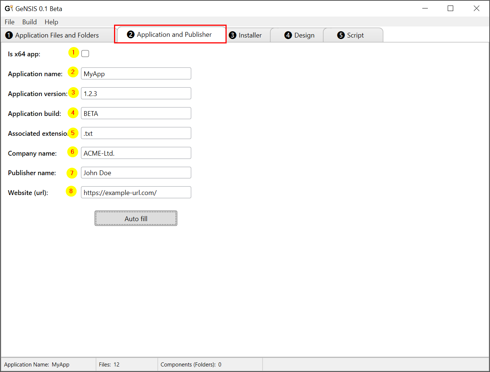
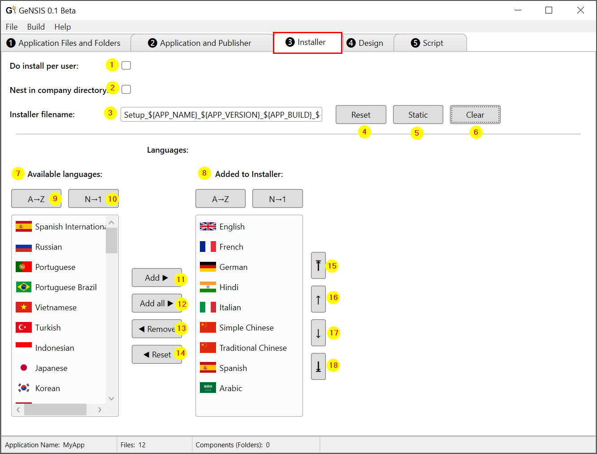
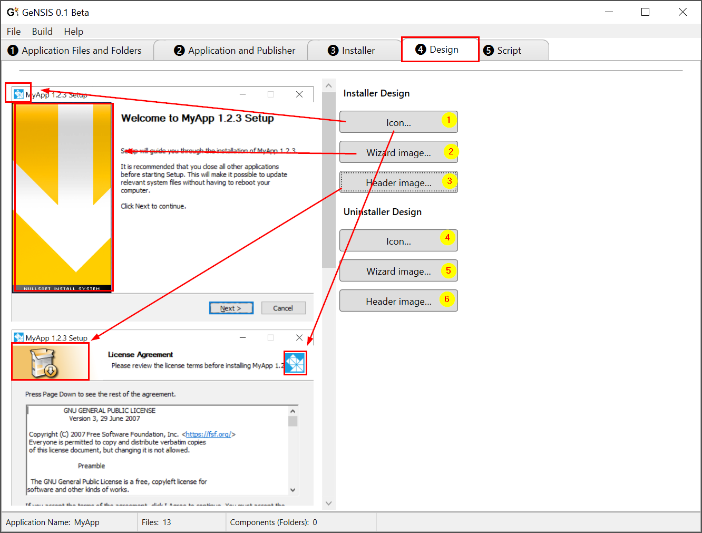
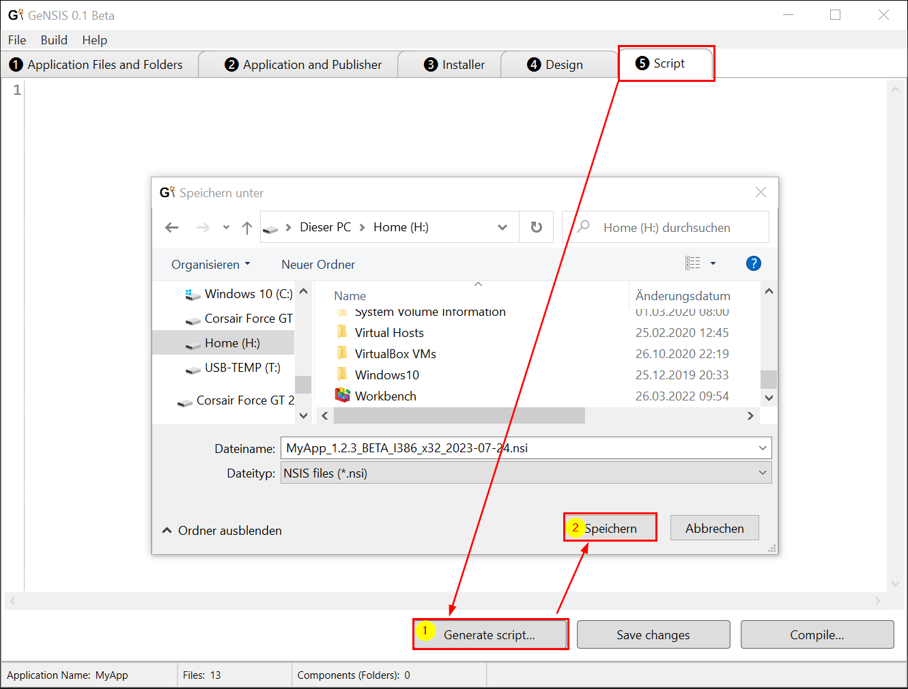
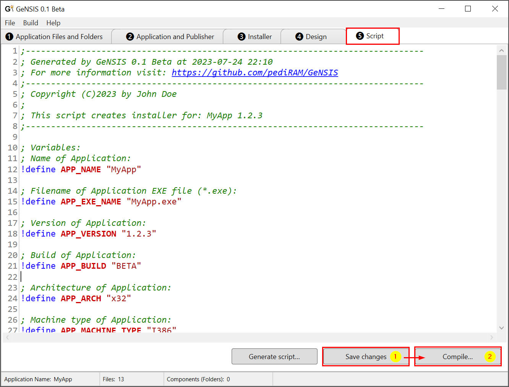
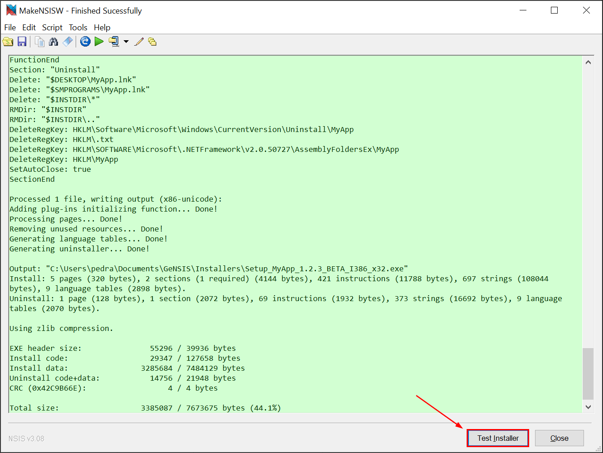
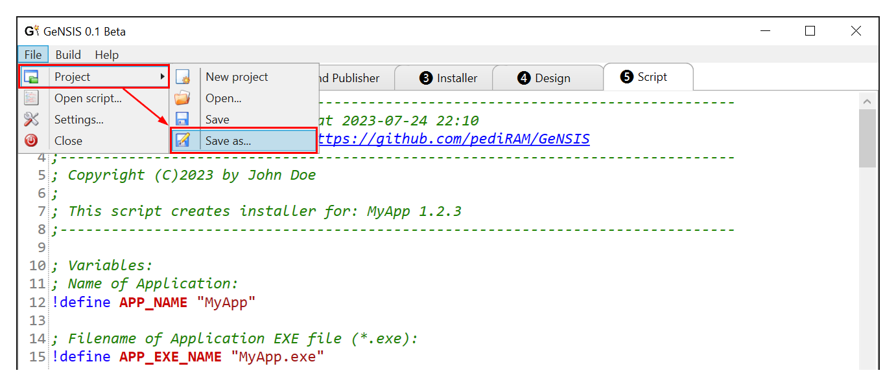

# 🚧 Almost done! 🚧

# TL;DR
**GeNSIS** is a .NET desktop application (ms win.) for auto-generating simple
NSIS-scripts fast and without pain.

## Dependencies:
- .NET 6 (runtime)
- NSIS 3

## Step by Step Tutorial
### (1) Application Files and Folders
After you have copied all needed files to a folder:
1. Click on the button **"Add folder..."** => A dialog will be opened
2. After you have navigated to the folder containing app install files, click on button **"Select folder"**
3. All files will be added to the project
4. The application executable will be automatically detected (you can change this)
5. Also the license file (*.txt or *.rtf) will be automatically detected (you can change this)

---
### (2) Application and Publisher
Now you can set the properties about your organisation/company, publisher etc. as follow:
1. (Optional) set/unset whether your app is an x64 app (is detected and set automatically)
2. (Optional) modify the auto-detected name of your app
3. (Optional) edit the auto-detected version of your app
4. (Optional) type an arbitary build like DEBUG, Release-Candidate, Demo ... or leave blank
5. (Optional) type the file extension which should be assigned to your app or leave blank
6. Type the name or initials of your organization/company/...
7. Type the name of the publisher of the app
8. Type the homepage of your app/company/organization

---
### (3) Installer
In the tab **"Installer"** you can modify the installer and installation behaviour:
1. Set/unset whether your app should be installed for user or for everyone
2. Whether the app folder should be nested in the company/organization folder or not
3. Edit the filename of installer
4. Click on **"Reset"** button will undo changes to installer-filename
5. You can create a static filename by clicking on the **"Static"** button
6. Click on **"Clear"** to remove/clear the textfield (marked with 3)
7. Ch <--- bis hier her!








### Example for auto-generated NSIS-Script:
```nsis
;-------------------------------------------------------------------------------
; Generated by GeNSIS 0.1 Beta at 2023-07-24 22:10
; For more information visit: https://github.com/pediRAM/GeNSIS
;-------------------------------------------------------------------------------
; Copyright (C)2023 by John Doe
;
; This script creates installer for: MyApp 1.2.3
;-------------------------------------------------------------------------------

; Variables:
; Name of Application:
!define APP_NAME "MyApp"

; Filename of Application EXE file (*.exe):
!define APP_EXE_NAME "MyApp.exe"

; Version of Application:
!define APP_VERSION "1.2.3"

; Build of Application:
!define APP_BUILD "BETA"

; Architecture of Application:
!define APP_ARCH "x32"

; Machine type of Application:
!define APP_MACHINE_TYPE "I386"

; File extension associated to Application:
!define FILE_EXTENSION ".txt"

; Application Publisher (company, organisation, author):
!define APP_PUBLISHER "John Doe"

; Name or initials of the company, organisation or author:
!define COMPANY_NAME "ACME-Ltd."

; URL of the Application Website starting with 'https://' :
!define APP_URL "https://example-url.com/"

; Name of setup/installer EXE file (*.exe):
!define SETUP_EXE_NAME "Setup_${APP_NAME}_${APP_VERSION}_${APP_BUILD}_${APP_MACHINE_TYPE}_${APP_ARCH}.exe"
;-------------------------------------------------------------------------------

; Available compressions: zlib, bzip2, lzma
SetCompressor zlib

Unicode true

RequestExecutionLevel admin

; Displayed and registered name:
Name "${APP_NAME} ${APP_VERSION}"

; You can also use: "Setup_${APP_NAME}_${APP_VERSION}.exe"
OutFile "${SETUP_EXE_NAME}"
;-------------------------------------------------------------------------------

; Path of uninstallation keys in registry:
!define UNINST_KEY "Software\Microsoft\Windows\CurrentVersion\Uninstall\${APP_NAME}"
!define UNINST_ROOT_KEY "HKLM"
;-------------------------------------------------------------------------------

; Using modern user interface for installer:
!include "MUI.nsh"

; Installer icons (*.ico):
!define MUI_ICON "C:\Program Files (x86)\NSIS\Contrib\Graphics\Icons\nsis3-install.ico"

; Uninstaller icon (*.ico):
!define MUI_UNICON "C:\Program Files (x86)\NSIS\Contrib\Graphics\Icons\nsis3-install.ico"

!define MUI_HEADERIMAGE

; Installer Header Image:
!define MUI_HEADERIMAGE_BITMAP "C:\Program Files (x86)\NSIS\Contrib\Graphics\Header\orange.bmp"
!define MUI_HEADERIMAGE_BITMAP_NOSTRETCH

; Installer Wizard Image:
!define MUI_WELCOMEFINISHPAGE_BITMAP "C:\Program Files (x86)\NSIS\Contrib\Graphics\Wizard\arrow.bmp"
!define MUI_WELCOMEFINISHPAGE_BITMAP_NOSTRETCH


!define MUI_ABORTWARNING
;-------------------------------------------------------------------------------

; Show welcome page:
!insertmacro MUI_PAGE_WELCOME
; License file (*.txt|*.rtf):
!insertmacro MUI_PAGE_LICENSE "H:\MyTemp\__Install Files for MyApp 1.2.3\MyApp 1.2.3\License.txt"
!insertmacro MUI_PAGE_DIRECTORY
!insertmacro MUI_PAGE_INSTFILES
!insertmacro MUI_PAGE_FINISH
!insertmacro MUI_UNPAGE_INSTFILES
;-------------------------------------------------------------------------------

; Available languages (first one is the default):
!insertmacro MUI_LANGUAGE "English"
!insertmacro MUI_LANGUAGE "French"
!insertmacro MUI_LANGUAGE "German"
!insertmacro MUI_LANGUAGE "Hindi"
!insertmacro MUI_LANGUAGE "Italian"
!insertmacro MUI_LANGUAGE "SimpChinese"
!insertmacro MUI_LANGUAGE "TradChinese"
!insertmacro MUI_LANGUAGE "Spanish"
!insertmacro MUI_LANGUAGE "Arabic"

; Function to show the language selection page:
Function .onInit
!insertmacro MUI_LANGDLL_DISPLAY
FunctionEnd
;-------------------------------------------------------------------------------

; Installation folder (Programs\Company\Application):
InstallDir "$ProgramFiles\${APP_NAME}"

; Showing details while (un)installation:
ShowInstDetails show
ShowUninstDetails show
;-------------------------------------------------------------------------------

; Main Section (first component/section), which is mandatory. This means:
; user cannot unselect this component/section (if there are two or more).
Section "Required" SEC01
SetOutPath "$INSTDIR"
SetOverwrite ifnewer

; Add directories recursively (remove /r for non-recursively):
File /r "H:\MyTemp\__Install Files for MyApp 1.2.3\MyApp 1.2.3\Manuals"
File /r "H:\MyTemp\__Install Files for MyApp 1.2.3\MyApp 1.2.3\Tutorials"
;-------------------------------------------------------------------------------

; Add files:
File "H:\MyTemp\__Install Files for MyApp 1.2.3\MyApp 1.2.3\D3DCompiler_47_cor3.dll"
File "H:\MyTemp\__Install Files for MyApp 1.2.3\MyApp 1.2.3\License.txt"
File "H:\MyTemp\__Install Files for MyApp 1.2.3\MyApp 1.2.3\MyApp.deps.json"
File "H:\MyTemp\__Install Files for MyApp 1.2.3\MyApp 1.2.3\MyApp.dll"
File "H:\MyTemp\__Install Files for MyApp 1.2.3\MyApp 1.2.3\MyApp.exe"
File "H:\MyTemp\__Install Files for MyApp 1.2.3\MyApp 1.2.3\MyApp.runtimeconfig.json"
File "H:\MyTemp\__Install Files for MyApp 1.2.3\MyApp 1.2.3\PenImc_cor3.dll"
File "H:\MyTemp\__Install Files for MyApp 1.2.3\MyApp 1.2.3\PresentationNative_cor3.dll"
File "H:\MyTemp\__Install Files for MyApp 1.2.3\MyApp 1.2.3\vcruntime140_cor3.dll"
File "H:\MyTemp\__Install Files for MyApp 1.2.3\MyApp 1.2.3\wpfgfx_cor3.dll"
File "C:\Program Files (x86)\NSIS\Contrib\Graphics\Icons\nsis3-install.ico"
;-------------------------------------------------------------------------------

; Create association of file extension to application:
WriteRegStr HKCR "${FILE_EXTENSION}" "" "${APP_NAME}"
WriteRegStr HKCR "${APP_NAME}" "" "${APP_NAME} File"
WriteRegStr HKCR "${APP_NAME}\DefaultIcon" "" "$INSTDIR\${APP_EXE_NAME},0"
WriteRegStr HKCR "${APP_NAME}\Shell\Open\Command" "" "$\"$INSTDIR\${APP_EXE_NAME}$\" $\"%1$\""
;-------------------------------------------------------------------------------

; Create shortcuts on Desktop and Programs menu.
CreateShortcut "$DESKTOP\${APP_NAME}.lnk" "$INSTDIR\${APP_EXE_NAME}" ""
CreateShortcut "$SMPROGRAMS\${APP_NAME}.lnk" "$INSTDIR\${APP_EXE_NAME}" ""
SectionEnd
;-------------------------------------------------------------------------------

;-------------------------------------------------------------------------------

Section -Post
WriteUninstaller "$INSTDIR\uninst.exe"
WriteRegStr ${UNINST_ROOT_KEY} "${UNINST_KEY}" "DisplayName" "$(^Name)"
WriteRegStr ${UNINST_ROOT_KEY} "${UNINST_KEY}" "DisplayIcon" "$INSTDIR\${APP_EXE_NAME}"
WriteRegStr ${UNINST_ROOT_KEY} "${UNINST_KEY}" "DisplayVersion" "${APP_VERSION}"
WriteRegStr ${UNINST_ROOT_KEY} "${UNINST_KEY}" "URLInfoAbout" "${APP_URL}"
WriteRegStr ${UNINST_ROOT_KEY} "${UNINST_KEY}" "Publisher" "${APP_PUBLISHER}"
WriteRegStr ${UNINST_ROOT_KEY} "${UNINST_KEY}" "UninstallString" "$INSTDIR\uninst.exe"
WriteRegStr ${UNINST_ROOT_KEY} "${UNINST_KEY}" "QuietUninstallString" '"$INSTDIR\uninst.exe" /S'
SectionEnd
;-------------------------------------------------------------------------------

; After application is sucessfully uninstalled:
Function un.onUninstSuccess
HideWindow
; You can change the message to suite your needs:
MessageBox MB_ICONINFORMATION|MB_OK "Application successfully removed."
FunctionEnd
;-------------------------------------------------------------------------------

; Before starting to uninstall:
Function un.onInit
; You can change the message to suite your needs:
MessageBox MB_ICONQUESTION|MB_YESNO|MB_DEFBUTTON2 "Are you sure you want to remove ${APP_NAME}?" IDYES +2
Abort
FunctionEnd
;-------------------------------------------------------------------------------

Section Uninstall
; Delete shortcuts on Desktop and Programs menu:
Delete "$DESKTOP\${APP_NAME}.lnk"
Delete "$SMPROGRAMS\${APP_NAME}.lnk"
; Deleting all files:
Delete "$INSTDIR\*"
RMDir "$INSTDIR"
RMDir "$INSTDIR\.."

; Deleting registration keys:
DeleteRegKey ${UNINST_ROOT_KEY} "${UNINST_KEY}"
DeleteRegKey ${UNINST_ROOT_KEY} "${FILE_EXTENSION}"
DeleteRegKey ${UNINST_ROOT_KEY} "SOFTWARE\Microsoft\.NETFramework\v2.0.50727\AssemblyFoldersEx\${APP_NAME}"
DeleteRegKey ${UNINST_ROOT_KEY} "${APP_NAME}"

SetAutoClose true
SectionEnd

```


 

